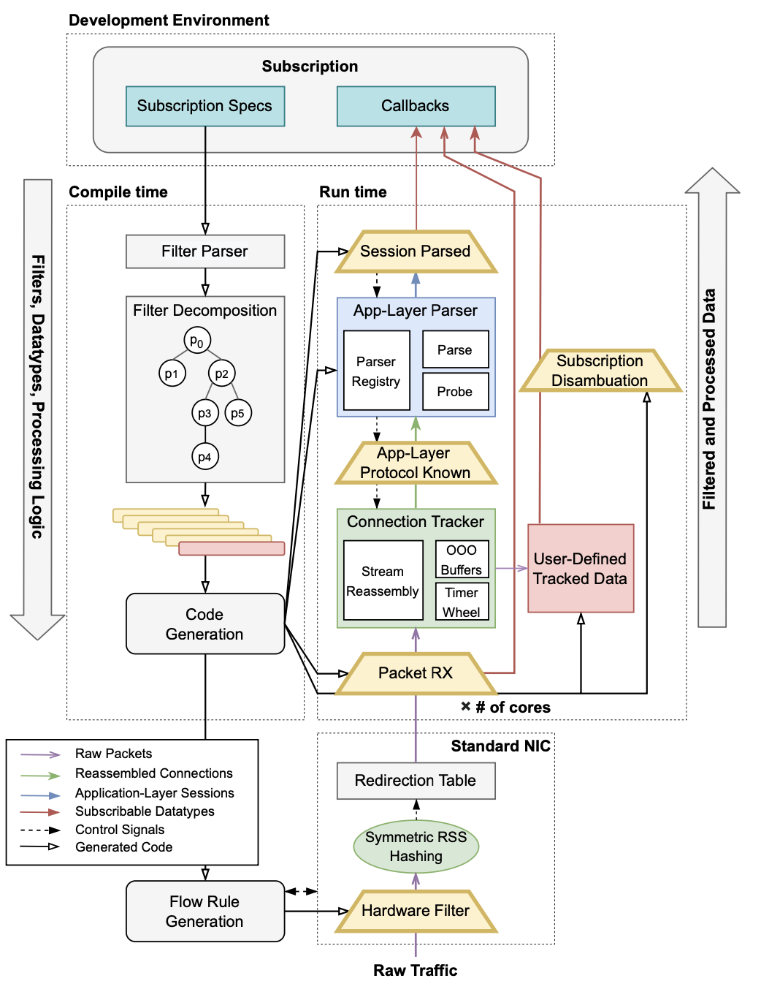
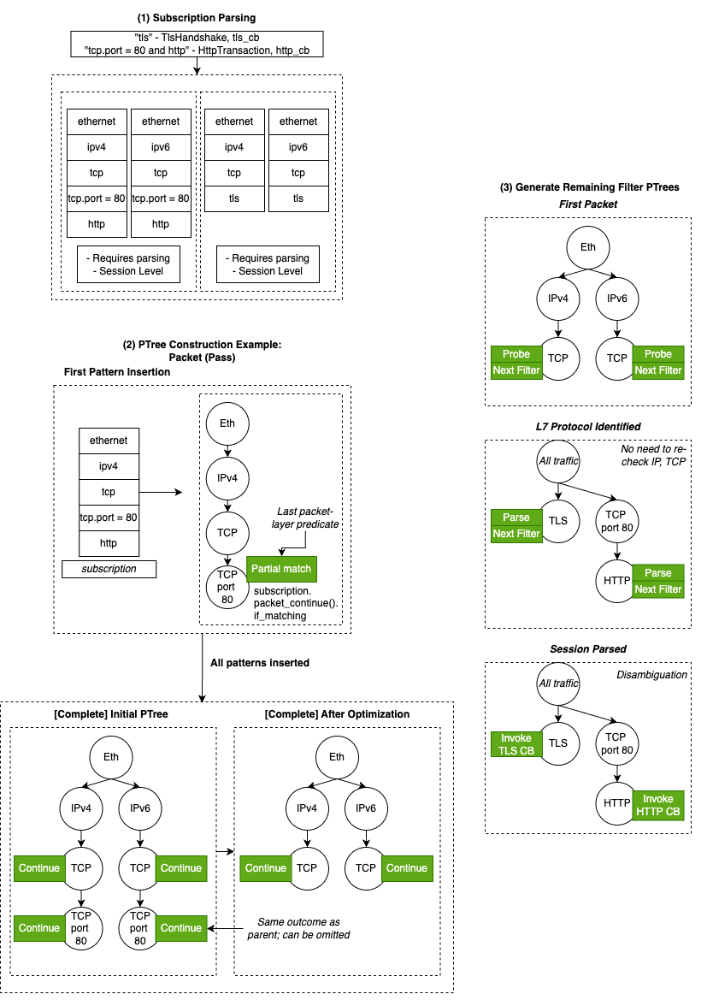
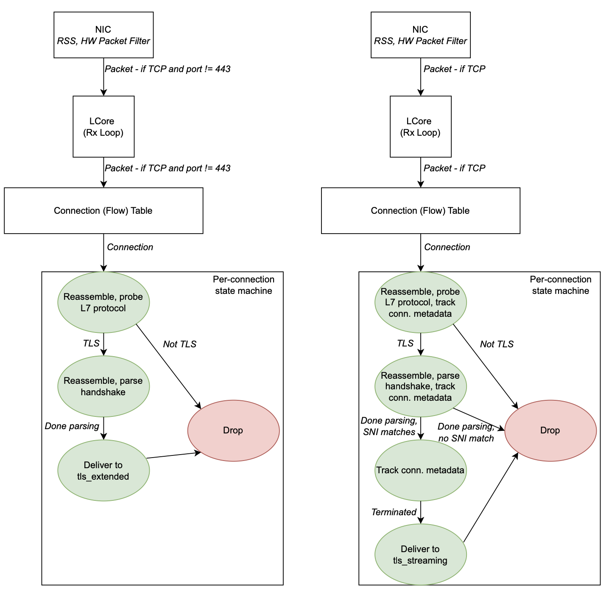

# Retina (v1.0.0) Detailed Developer Documentation

This document is intended as a resource for Retina developers and contributors. It is meant to supplement the core [developer documentation](https://stanford-esrg.github.io/retina/retina_core/) and the [original paper](https://zakird.com/papers/retina.pdf). It contains a more detailed and centralized system design description than the documentation. Compared to the original paper, it both reflects more recent changes and inlines links to relevant code.

Retina is in its early stages, and we are actively working on new releases and research that will significantly expand its utility. We welcome contributors and open issues, and we would love to hear about your use-cases (especially if Retina doesn't suit your needs!).

## Subscribing to Traffic

A Retina application consists of one or more "subscriptions", each of which includes datatype(s), a callback, and a filter. For each subscription, the *callback* will be invoked for all network traffic that matches the *filter*. This traffic will be delivered to the requested callback in the form of assembled *datatype(s)* (e.g., a parsed TLS handshake). As [documented](https://stanford-esrg.github.io/retina/retina_filtergen/index.html), subscriptions can be defined in a `toml` or directly in a `.rs` file.

All subscriptions are applied to (five-tuple) connections. It is currently impossible to filter or request datatypes that cross connection boundaries (for example, multiple flows initiated by the same host). For applications that require this, we recommend multiple callbacks with a shared data structure (e.g., indexed by port, source IP, etc).

Each callback is invoked at a pre-defined "stage" in the connection, which is determined by (1) when *all* requested datatypes can be fully assembled and (2) when the filter can be definitively matched (or not). These stages are (1) on connection termination, (2) per-packet (after filter match), or (3) when an L7 protocol session (e.g., TLS handshake) is fully parsed. We expect to support streaming data by early 2025.

## Notes on Writing a Retina Application

We encourage and welcome contributions to the [examples](https://github.com/stanford-esrg/retina/tree/main/examples) directory!

Available datatypes can be found in Retina's [datatypes crate](https://github.com/stanford-esrg/retina/tree/main/datatypes). The filter language is documented in the [filtergen crate](https://github.com/stanford-esrg/retina/blob/main/filtergen/src/lib.rs).

In Retina v0.1.0, callbacks could be defined as closures. In Retina v1, they cannot; this means that any state must be defined statically (e.g., OnceCell, lazy_static) with appropriate synchronization. The CoreId (static) datatype can be used to create zero-lock data structures, as in many of the [examples](https://github.com/stanford-esrg/retina/tree/main/examples).

In 2025, we intend to extend Retina's filter expressiveness significantly, add support for streaming datatypes and early-return callbacks, and introduce utilities that make writing callbacks easier (e.g., cross-core message passing).

### Performance Considerations

Some subscriptions are inherently more expensive than others. In general, we find that the performance of a Retina application depends most on:
- **Callback complexity**: If the application spends too long (CPU cycles) in a callback, DPDK's [Rx queue](https://doc.dpdk.org/guides/prog_guide/ring_lib.html) may fill up and begin to drop packets.
- **Filter breadth**: Retina's multi-stage filter pipeline eagerly discards out-of-scope traffic to reduce computational burden at subsequent processing steps. If a filter requires processing a large portion of traffic, Retina's filtering infrastructure does not provide performance benefit.
- **Datatype complexity**: some datatypes are more expensive to process than others. For example, we have found that packet list datatypes, which cache raw packets, may exhaust DPDK's mempool resources. Similarly, datatypes that require parsing and reassembly (which can be computationally expensive) throughout connections may encounter CPU bottlenecks.
- **Network conditions**: Very lossy networks will require expensive TCP reassembly (see "stream reassembly"), which can create both computate and mempool bottlenecks.

### Datatypes

Subscriptions cannot be delivered until (1) a filter has definitively matched, and (2) all datatypes are fully assembled. The latter is dictated by the datatype's level ([source](https://github.com/stanford-esrg/retina/blob/main/core/src/filter/datatypes.rs)).

* A *Connection-Level* datatype can only be fully assembled by the end of the connection. Examples include connection duration, a list of inter-packet arrival times, and TCP flag history. Any subscription that includes a connection-level datatype will be delivered when the connection terminates.
* A *Session-Level* datatype is fully assembled -- and can be delivered -- when the L7 session (TLS handshake, HTTP transaction, etc.) is fully parsed. However, if a session-level datatype is requested alongside a connection-level datatype, the session will be cached until the connection terminates.
* A *Packet-Level* datatype (e.g., raw frame, per-packet payload) can be delivered as soon as a corresponding filter matches. A raw packet cannot be requested in the same subscription as a higher-level datatype, however Retina does provide packet lists.
* A *Static-Level* datatype is constant throughout a connection and inferrable at first packet (e.g., five-tuple, Core ID). It can be delivered when its filter matches and other datatypes in its subscription can be delivered.
* We expect to support streaming data by early 2025.

All defined datatypes specify the operations they require (e.g., parsing, pre-reassembly update) via the Datatype struct ([source](https://github.com/stanford-esrg/retina/blob/main/core/src/filter/datatypes.rs)) and implement pre-defined methods that can be invoked by the framework ([source](https://github.com/stanford-esrg/retina/blob/main/datatypes/src/lib.rs)).

For example, many "connection feature" datatypes (e.g., packet count, TCP flag history) require an `update` operation when a new packet is received. Most "session" datatypes require parsing and provide a `from_session` API.

#### Filtering for Raw Packets

For any datatype, it is currently impossible to filter for both (1) fields that can *only* be checked in individual packets and (2) fields that can *only* be checked at a parsing layer. For example, you cannot filter for "tls packets that are larger than N bytes" or "SYN packets in an HTTP connection with a specific user-agent" ([issue](https://github.com/stanford-esrg/retina/issues/66)).

To achieve similar behavior, users can define new datatypes and/or subscribe to packet lists. For example, to subscribe to "tls packets that are larger than N bytes", one could define a connection-level datatype that caches packets larger than N bytes and subscribe to this datatype with a "tls" filter.

#### Subscribing to Raw Packets

Packet-level subscriptions can only support one datatype (alongside, optionally, the Core ID on which the packet is processed). For those who wish to subscribe to raw packets *and* higher-level data, or who wish to receive multiple packets in one callback invocation, see the PacketList [datatypes](https://github.com/stanford-esrg/retina/tree/main/datatypes/src).

When subscribing to a Packet-Level datatype with a filter that matches at a connection or session level, the callback will be invoked for all packets in the connection. For example, requesting raw packets with a "tls.sni ~ abc" filter will deliver all packets in all connections for which the TLS sni matches "abc", including ciphertext.

#### Subscribing to Static Datatypes

A subscription for a static datatype only (e.g., FiveTuple) will be delivered once per connection and as soon as the relevant filter has matched.

## Interpreting Runtime Output

Depending on [configuration](https://github.com/stanford-esrg/retina/blob/main/core/src/config.rs), Retina can print and/or log statistics [queried via DPDK](https://github.com/stanford-esrg/retina/blob/main/core/src/lcore/monitor.rs).

Mempool availability indicates the percentage of each DPDK mempool (not RAM) consumed by the application. In online mode, Retina initializes one mempool per socket. This may be high if raw `Mbufs` are retained in memory for too long (likely for a PacketList datatype or reassembly).

The typical NIC statistics are as follows:
- Ingress: packets/bytes that hit the NIC (`rx_phy_packets`/`rx_phy_bytes` in DPDK)
- Good: packets/bytes after hardware filtering and CRC checking (`rx_good_packets` / `rx_good_bytes` in DPDK)
- Process: packets/bytes received by lcores running the RX loop *after flow sampling* (sink core) if applicable (`rx_good_* - sink_*`)
- HW dropped: packets reported dropped by the NIC due to lack of physical buffers (`rx_phy_discard_packets` in DPDK)
- SW dropped: packets received on the NIC but not processed by software, typically due to lack of mbufs or space in an RX queue (`rx_missed_errors` in DPDK).

## Interpreting Compile-Time Output

An important part of Retina pipeline occurs at *compile-time*. This code is defined in the [filtergen](https://github.com/stanford-esrg/retina/tree/main/filtergen/src) crate. At a high level, this crate generates:
- Filtering logic: all filters for all subscriptions are decomposed into filter "layers" (e.g., per-packet, following session parse, etc.), combined with each other, and optimized to remove redundant or unnecessary conditions.
- Datatype wrapper: all datatypes for all subscriptions are deduplicated and combined into a Tracked datatype, which is [Trackable](https://github.com/stanford-esrg/retina/blob/main/core/src/subscription/mod.rs) trait.
- Callback invocation: callbacks are invoked within the generated filters.

During compilation, Retina prints out the generated filters (including callback invocations) and datatypes, as well as the application-layer protocol parsers required by the application.

### Filters

Filters are represented as a trie. Not all filter layers will be applied for all applications; for example, an application that does not require L7 protocol parsing will not apply the "Session" filter.

The following filter layers may be present:
- Pkt (pass): applied to each packet, possibly in hardware, which will either drop packets, "pass" them to the connection handler, and/or deliver them.
	- If hardware support is true, a "drop/keep" version of this filter will also be installed on the NICs.
- Pkt: applied to the first packet in each connection. This initializes Actions for each connection.
- Proto: applied when the L7 protocol is identified. This will either drop the connection or pass it to a subsequent processing stage.
- Session: applied when the L7 protocol session is parsed. This will either drop the session (and potentially the connection), deliver the session, and/or pass the connection to a subsequent processing stage.
- Connection (Deliver): applied when the connection terminates. This will deliver any Connection-level subscriptions.
- Pkt (Deliver): applied per-packet if (1) a connection requires all packets to be delivered and (2) they cannot be delivered in the Packet filter. This is relevant when a subscription requests a stateful/L7 filter (e.g., "tls") with a packet-level datatype.
- We expect to support streaming filters by early 2025.

The filter trees will include callback invocations and/or actions.

Each "action" indicates to the runtime *what operation(s) it should apply next* to a given packet, connection, or session. For example, a subscription for "dns" traffic and the "DnsTransaction" datatype will require -- if it has matched -- session parsing after the "protocol identified" filter. "Terminal actions" are retained for the duration of the connection. Actions are described in more detail below.

Some optimizations are applied to the filters at compile-time. For example, the framework will attempt to avoid reapplying conditions that are guaranteed to be true based on the results of previous filters. An `x` in the filter output indicates mutual exclusion and corresponds to an `else if` condition in code. Filter optimizations are described in more detail below.

## Sink Cores and Flow Sampling

Users can configure flow sampling by configuring a [sink core](https://stanford-esrg.github.io/retina/retina_core/config/struct.SinkConfig.html). RSS directs a subset of flows to the sink core, which immediately drops them.

One sink core is required per interface. Note that sink cores currently are not compatible with hardware filtering. `hardware_assist` should be disabled when configuring a sink core.

## Retina Pipeline

Retina compiles subscriptions into a work-conserving pipeline that (1) eagerly discards out-of-scope traffic, (2) lazily reconstructs relevant network data, and (3) shares processing work and data between subscriptions.

- We observe that most analysis questions require fully processing only a subset of Internet traffic. A multi-stage filtering infrastructure allows Retina to iteratively discard extraneous traffic as early and often as possible, dramatically reducing unnecessary computation.
- Retina's runtime pipeline is designed to minimize wasted computation on traffic that will be discarded by later filters. The framework defers expensive operations until it is confident that the operation is needed to achieve the desired analysis result (lazy data reconstruction).
- Multiple subscriptions are executed by a single runtime pipeline. While the number of subscriptions a user can request is unbounded, the set of possible operations required to *execute* these subscriptions is limited. At compile-time, the system leverages a global view of all subscriptions -- filters, datatypes, and callbacks -- to build an application-specific runtime that eliminates redundant and unnecessary operations.

### Compile-Time Processing

Compile-time code generation is handled by the [retina-filtergen crate](https://github.com/stanford-esrg/retina/tree/main/filtergen), which invokes helpers from the core library's [filter](https://github.com/stanford-esrg/retina/tree/main/core/src/filter) and [protocol](https://github.com/stanford-esrg/retina/tree/main/core/src/protocols) modules. At a high level, the framework ingests and combines all subscriptions to create (1) the (multi-stage) filters described above and (2) a trackable "wrapper" struct representing the union of all requested datatypes and implementing the [Trackable](https://github.com/stanford-esrg/retina/blob/main/core/src/subscription/mod.rs) trait.

The compile-time pipeline begins by translating each subscription into a structured specification that includes the callback, datatype(s), and filter. The retina-datatypes crate provides necessary information about each datatype: what `Level` it can be delivered at and the operations it requires.

The framework [parses]((https://github.com/stanford-esrg/retina/blob/main/core/src/filter/parser.rs)) each filter into a list of disjunct [Patterns](https://github.com/stanford-esrg/retina/blob/main/core/src/filter/pattern.rs), each of which contains one or more [Predicates](https://github.com/stanford-esrg/retina/blob/main/core/src/filter/ast.rs). Predicates are either explicit in the filter or inferred from protocol layers (see [`LAYERS`](https://github.com/stanford-esrg/retina/blob/main/core/src/filter/ast.rs)). (For example, the filter "tcp.port = 80 and http" would become two Patterns: [["ethernet", "ipv4", "tcp", "tcp.port = 80", "http"], ["ethernet", "ipv6", "tcp", "tcp.port = 80", "http"]].) Retina uses [`pest`](https://pest.rs) to define the filter [grammar](https://github.com/stanford-esrg/retina/blob/main/core/src/filter/grammar.pest).

The framework builds a predicate trie ([PTree](https://github.com/stanford-esrg/retina/blob/main/core/src/filter/ptree.rs)) for each filter layer (packet, session, connection delivery, etc.).  Conceptually, each pattern becomes a root-to-node path which input data must match in order to satisfy a filter. As noted above, PTrees capture *the union of all subscriptions in an application*.

Each PTree node that terminates a Pattern will contain either `Actions` or callback invocations. `Actions` are [determined by](https://github.com/stanford-esrg/retina/blob/main/core/src/filter/datatypes.rs) the `Datatype`s in a subscription and filter state. Note that each PTree stage contains only those predicates which can be definitive checked at its stage (e.g., the tls SNI cannot be checked per-packet). The Actions for a "matching" (partially matched) filter differ from those of a fully matched filter.

Below is one example of the generated PTrees for a Retina application with two subscriptions.

The filtergen crate uses each PTree to generate filter code. Filters return Actions. Callbacks -- including data reconstruction, if necessary -- are inlined within filters.

Finally, the filtergen crate combines the required datatypes into one [Trackable](https://github.com/stanford-esrg/retina/blob/main/core/src/subscription/mod.rs) type, which provides methods that can be invoked by the runtime.

Use [`cargo expand`](https://crates.io/crates/cargo-expand) to view the generated code for your application.

### Runtime System

At a high level, Retina receives raw packets from the network and builds increasingly more complex segments of data up through each filtering layer while executing callback(s) with the user's subscription data. The runtime framework consists of (1) stateless packet processing and (2) stateful connection tracking.

#### Stateless Packet Processing

- The NIC applies an initial filter to ingress packets. This hardware filter is installed at application startup [if configured](https://stanford-esrg.github.io/retina/retina_core/config/struct.OnlineConfig.html) and supported by the NIC.
- Receive Side Scaling (RSS) distributes packets among cores for software packet-processing. (Packets associated to the same five-tuple are forwarded to a consistent core.)
- Retina uses DPDK to deliver raw packets from the NIC directly to user-space memory.
- Packets are filtered again in software to discard those that cannot be filtered in hardware (e.g., due to unsupported header fields or operands) and to deliver subscriptions that do not require connection traffic.
- If required by the subscription data type and result of the packet filter, Retina forwards packets to the Connection Tracker.

#### Stateful Connection Processing

Each core maintains a connection [table](https://github.com/stanford-esrg/retina/blob/main/core/src/conntrack/mod.rs) that maps connection IDs (five-tuples) to connection state (parsers, tracked data, required operations, etc.).

New connections are inserted when the connection tracker receives (1) a TCP SYN or (2) a UDP packet that does not correspond to an existing connection.

To avoid memory exhaustion from inactive connections, Retina implements a [timer wheel](https://github.com/stanford-esrg/retina/blob/main/core/src/conntrack/timerwheel.rs) that regularly polls for and removes [inactive](https://stanford-esrg.github.io/retina/retina_core/config/struct.ConnTrackConfig.html) connections. Retina applies both a short connection establishment timeout to expire unanswered SYNs and longer inactivity timeouts to remove established inactive connections (TCP and UDP inactivity timeouts are configured separately).

A connection is "terminated" either when it times out or, in the case of TCP, when both sides have sent FINs and ACKs for FINs. Note that this can make UDP connection processing more expensive; in the case of connection-level datatypes, state for matched connections may need to be maintained until the connection times out. When a UDP connection is discarded, its ID, without associated state, is retained in the connection table for a timeout period to prevent spurious re-insertion.

The per-connection logic is largely implemented in the [conntrack/conn](https://github.com/stanford-esrg/retina/tree/main/core/src/conntrack/conn) directory. Maintained state for each connection typically includes the currently-required Actions, application-specific Trackable data, application-layer parsers, TCP reassembly (if applicable), and timestamps (for expiration).

#### Multiple Subscriptions

We consider the analysis pipeline for each subscription as a per-connection state machine, where each "state" corresponds to required operations (e.g., reassembly, parsing) and filter stages execute state transitions. At compile-time, the system leverages a global view of all subscriptions -- filters, datatypes, and callbacks -- to build each subscription-specific state machine and compose them into a single per-connection state machine. Processing work is shared between subscriptions, and per-subscription disambiguation is deferred until the delivery stage. In addition to discarding out-of-scope *traffic*, state transitions discard out-of-scope *operations* as the subscriptions requiring them fail to match.

For example, consider a basic subscription that subscribes to TLS handshakes with different datatypes.

The figures below illustrate the processing pipeline, operations, and per-connection state machine for these subscriptions. The first figure represents each subscription as a separate processing pipeline. Clearly, this implementation would lead to redundant work: both subscriptions require TCP reassembly, L7 protocol probing, and TLS handshake parsing for datatype construction and/or filtering. The second figure demonstrates our combined processing pipeline. The packet-processing stage applies the union of the two packet-level filters when determining which packets to forward to connection tracking. Operations and state required by both subscriptions are shared. Disambiguation -- checking the TLS SNI and TCP port -- are deferred until the per-subscription state machines diverge.

	
	

### Stream Reassembly

Retina's TCP reassembly infrastructure re-orders raw packets as they arrive. The system caches out-of-order Mbufs into a configurable-length ring buffer which is flushed when the next expected segment arrives.

This approach is far more computationally efficient than reconstructing byte-streams by copying payloads into a receive buffer, as in traditional approaches to reassembly. However, it introduces a tradeoff with mempool utilization. On a lossy network, Mbufs are cached for reordering and may not be returned quickly enough to DPDK's memory pools. This can lead to high mempool utilization. We are exploring alternate approaches, such as initiating copies if observed sequence number gaps reach a certain threshold.

### Parsing and Sessions

Retina's application-layer (L7 protocol) parsers are defined in the [protocols/stream](https://github.com/stanford-esrg/retina/tree/main/core/src/protocols/stream) directory in the core library. Each Retina application builds a `ParserRegistry` from the union of L7 protocols required by all filters and all datatypes. The `ParserRegistry` exposes APIs that the [connection management system](https://github.com/stanford-esrg/retina/blob/main/core/src/conntrack/conn/conn_info.rs) invokes to identify and parse application-layer data.

Protocol parsers have two primary roles: probing and parsing.
- *Probing* (protocol identification): During a *probing* stage, each registered parser ingests each packet to determine whether a given connection matches its protocol.
	- When probing is complete, the `protocol_filter` can be applied.
- *Session parsing*: During a *parsing* stage, the parser identified from probing ingests each packets to assemble a `Session` (an enum containing the parsed datatype).
	- When parsing is complete, the `session_filter` can be applied and session-level subscriptions can be invoked.

Probing and parsing operations are invoked by the [connection management](https://github.com/stanford-esrg/retina/blob/main/core/src/conntrack/conn/conn_info.rs) infrastructure when required by `actions`. [`FromSession` datatypes](https://github.com/stanford-esrg/retina/blob/main/datatypes/src/lib.rs) are built from sessions returned by the framework's parsers.

We aim to support more application-layer protocols in the future, and we welcome contributions!

